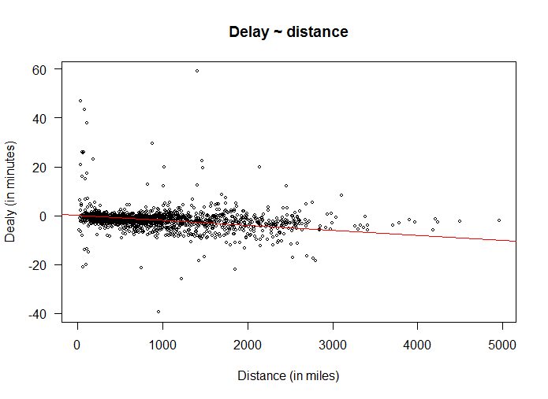

# Marta Walczak
Rozwiązania zadań z przedmiotu _Technologie NoSQL_, 2016/17


Wybrany zbiór danych: [Airline on time data](http://stat-computing.org/dataexpo/2009/the-data.html) z 2008 roku (ponad 7 milionów rekordów)

Dane do zadania geo: [Transportation/Airports](http://www.vdstech.com/world-data.aspx)

[Strona z rozwiązaniami zadań](https://mawala.github.io/projekty-nosql/)


1. Zaliczenie
 - [x] EDA
 - [ ] Aggregation Pipeline
1. Egzamin
 - [ ] MapReduce
 
Informacje o komputerze, na którym były wykonywane obliczenia:

| Nazwa                 | Wartosć             |
|-----------------------|---------------------|
| System operacyjny     | Windows 10 Pro x64  |
| Procesor              | Intel Core i7-7500u |
| Ilość rdzeni          | 2 Cores             |
| Pamięć                | 16 GB               |
| Dysk                  | 256 GB SSD          |
| Baza danych           | ElasticSearch 5.2, MongoDB, PostgreSQL 9.6   |


## Zadanie GEO

[Rozwiązanie](https://mawala.github.io/projekty-nosql/)

## Zadanie ElasticSearch/PostgreSQL

### Dane

Dane zapisane są w trzech plikach .csv:

 - *airports.csv* - rozmiar 238 KB, zawiera 3 376 rekordów postaci
 
| iata | airport | city        | state | country | lat         | long         | 
|------|---------|-------------|-------|---------|-------------|--------------| 
| 00M  | Thigpen | Bay Springs | MS    | USA     | 31.95376472 | -89.23450472 | 

 - *carriers.csv* - rozmiar 42,7 KB, zawiera 1 491 rekordów postaci

| Code  | Description     | 
|-------|-----------------| 
|  02Q  |  Titan Airways  | 

 - *2008.csv.bz2* - rozmiar 108 MB (po rozpakowaniu 657 MB), zawiera 7 009 728 rekordów, mających pola

|      | Name              | Description                                                               | 
|------|-------------------|---------------------------------------------------------------------------| 
| 1    | Year              | 1987-2008                                                                 | 
| 2    | Month             | 1-12                                                                      | 
| 3    | DayofMonth        | 1-31                                                                      | 
| 4    | DayOfWeek         | 1 (Monday) - 7 (Sunday)                                                   | 
| 5    | DepTime           | actual departure time (local, hhmm)                                       | 
| 6    | CRSDepTime        | scheduled departure time (local, hhmm)                                    | 
| 7    | ArrTime           | actual arrival time (local, hhmm)                                         | 
| 8    | CRSArrTime        | scheduled arrival time (local, hhmm)                                      | 
| 9    | UniqueCarrier     | unique carrier code                                                       | 
| 10   | FlightNum         | flight number                                                             | 
| 11   | TailNum           | plane tail number                                                         | 
| 12   | ActualElapsedTime | in minutes                                                                | 
| 13   | CRSElapsedTime    | in minutes                                                                | 
| 14   | AirTime           | in minutes                                                                | 
| 15   | ArrDelay          | arrival delay, in minutes                                                 | 
| 16   | DepDelay          | departure delay, in minutes                                               | 
| 17   | Origin            | origin IATA airport code                                                  | 
| 18   | Dest              | destination IATA airport code                                             | 
| 19   | Distance          | in miles                                                                  | 
| 20   | TaxiIn            | taxi in time, in minutes                                                  | 
| 21   | TaxiOut           | taxi out time in minutes                                                  | 
| 22   | Cancelled         | was the flight cancelled?                                                 | 
| 23   | CancellationCode  | reason for cancellation (A = carrier, B = weather, C = NAS, D = security) | 
| 24   | Diverted          | 1 = yes, 0 = no                                                           | 
| 25   | CarrierDelay      | in minutes                                                                | 
| 26   | WeatherDelay      | in minutes                                                                | 
| 27   | NASDelay          | in minutes                                                                | 
| 28   | SecurityDelay     | in minutes                                                                | 
| 29   | LateAircraftDelay | in minutes                                                                | 

  Na potrzeby zadań niektóre z powyższych pól pominęłam.
  
### PostgreSQL

W bazie rekordy danych z pliku *2008.csv* mają postać:

| Year | Month | DayOfMonth | DayOfWeek | DepTime | CRSDepTime | ArrTime | CRSArrTime | UniqueCarrier | FlightNum | TailNum | ActualElapsedTime | CRSElapsedTime | ArrDelay | DepDelay | Origin | Dest | Distance | Cancelled | CancellationCode | 
|------|-------|------------|-----------|---------|------------|---------|------------|---------------|-----------|---------|-------------------|----------------|----------|----------|--------|------|----------|-----------|------------------| 
| 2008 | 1     | 3          | 4         | 2003    | 1955       | 2211    | 2225       | WN            | 335       | N712SW  | 128               | 150            | -14      | 8        | IAD    | TPA  | 810      | 0         |                  | 

**Import danych**

Import danych wykonuje skrypt [import.cmd](skrypty/import.cmd). Pobiera on pliki .csv, za pomocą skryptów .sql

([create-port.sql](skrypty/create-port.sql), [create-carrier.sql](skrypty/create-carrier.sql), [create-ontime.sql](skrypty/create-ontime.sql))

tworzy tabele w bazie oraz zapisuje do nich dane.

Trwało to:

```shell
Minutes           : 6
Seconds           : 31
Milliseconds      : 465
```

Zajęcie pamięci

| Schemat |   Nazwa   |  Typ   | Właściciel | Rozmiar |
|---------|-----------|--------|------------|---------|
| air     | carrier   | tabela | postgres   | 128 kB  |
| air     | ontime    | tabela | postgres   | 836 MB  |
| air     | port      | tabela | postgres   | 344 kB  |


**Mniejsza baza**

Stworzyłam plik z 10000 losowych rekordów z bazy PostgreSQL i zapisałam je w pliku [2008-small.csv](skrypty/2008-small.csv) (rozmiar 989 KB).

```sql
COPY(SELECT * FROM import.ontime ORDER BY random() LIMIT 10000) to 'C:\sql\2008-small.csv' with CSV HEADER;

COPY 10000
Time: 5909.555 ms
```

Za pomocą skryptu [import-small.cmd](skrypty/import-small.cmd) można utworzyć tabele z tych danych.

Trwa to:++

```shell
Minutes           : 0
Seconds           : 5
Milliseconds      : 337
```

**Agregracje**

 1. Zliczanie rekordów poszczególnych tabel

```sql
SELECT COUNT(*) FROM air.port; SELECT COUNT(*) FROM air.carrier; SELECT COUNT(*) FROM air.ontime;
```

| count   | time (in ms) | 
|---------|--------------| 
| 3376    | 1.160        | 
| 1491    | 0.435        | 
| 7009728 | 691.282      |

 2. Różne agregacje
 
  - Suma opóźnień przylotów w zależności od dnia tygodnia, w którym odbył się loty
  
```sql
SELECT DayOfWeek AS "day (1=mon)", COUNT(*) AS fligths, SUM(ArrDelay)/(60*24) AS "delay (in days)"
FROM air.ontime WHERE cancelled=0 GROUP BY DayOfWeek ORDER BY DayOfWeek ASC;

Time: 2281.104 ms
```

| day (1=mon) | fligths | delay (in days) | 
|-------------|---------|-----------------| 
| 1           | 1015688 | 5778            | 
| 2           | 1008881 | 5226            | 
| 3           | 1019463 | 4606            | 
| 4           | 1014340 | 5911            | 
| 5           | 1011204 | 7674            | 
| 6           | 843969  | 3383            | 
| 7           | 958749  | 6305            | 

  - Ilość anulowanych lotów w zależności od powodu anulowania
  
  ```sql
SELECT 
  (CASE CancellationCode WHEN 'A' THEN 'carrier' 
                         WHEN 'B' THEN 'weather'
                         WHEN 'C' THEN 'NAS'
                         ELSE 'security' END) as reason, 
  count(*) as "cancelled flights" FROM air.ontime 
  WHERE Cancelled=1 GROUP BY CancellationCode;

Time: 1285.757 ms
```

| reason   | cancelled flights | 
|----------|-------------------| 
| weather  | 54904             | 
| carrier  | 54330             | 
| security | 12                | 
| NAS      | 28188             | 

  - Pięć lotnisk, mających najdłuższe opóźnienia odlotów
  
```sql
SELECT Airport, SUM(DepDelay) AS "deport delay", COUNT(*) AS flights,
       (SUM(DepDelay)*1.0 / COUNT(*))::NUMERIC(10,2) AS "delay per flight"
       FROM air.ontime JOIN air.port ON Origin=Iata WHERE Cancelled=0 GROUP BY Airport
       ORDER BY "delay per flight" DESC LIMIT 5;

Time: 3646.209 ms
```

| airport            | deport delay | flights | delay per flight | 
|--------------------|--------------|---------|------------------| 
| Nantucket Memorial | 12509        | 419     | 29.85            | 
| Pueblo Memorial    | 54           | 2       | 27.00            | 
| Jack McNamara      | 24549        | 1015    | 24.19            | 
| Pierre Regional    | 114          | 5       | 22.80            | 
| Capital            | 24889        | 1115    | 22.32            | 

  - Opóźnienia poszczególnych przewoźników
  
```sql
SELECT carrier, name, flights, delay, delay/flights AS "delay per flight" FROM
  (SELECT uniquecarrier AS carrier, SUM(DepDelay + ArrDelay) AS delay FROM air.ontime 
    GROUP BY uniquecarrier) AS tab1 
  JOIN 
  air.carrier ON code=carrier 
  JOIN 
  (SELECT description AS name, count(*) AS flights FROM air.ontime 
    JOIN air.carrier ON code=uniquecarrier GROUP BY description) AS tab2 
  ON name=description;

Time: 5091.201 ms
```

| carrier | name                         | flights        | delay    | delay per flight | 
|---------|------------------------------|----------------|----------|------------------| 
| CO      | Continental Air Lines Inc.   | 298455         | 7086260  | 23.74            | 
| 9E      | Pinnacle Airlines Inc.       | 262208         | 2758121  | 10.52            | 
| UA      | United Air Lines Inc.        | 449515         | 11105221 | 24.70            | 
| F9      | Frontier Airlines Inc.       | 95762          | 1145691  | 11.96            | 
| OH      | Comair Inc.                  | 197607         | 4448460  | 22.51            | 
| AA      | American Airlines Inc.       | 604885         | 15126423 | 25.01            | 
| US      | US Airways Inc. (...)        | 453589         | 3807495  | 8.39             | 
| WN      | Southwest Airlines Co.       | 1201754        | 18400395 | 15.31            | 
| EV      | Atlantic Southeast Airlines  | 280575         | 6083048  | 21.68            | 
| MQ      | American Eagle Airlines Inc. | 490693         | 9668020  | 19.70            | 
| HA      | Hawaiian Airlines Inc.       | 61826          | 104282   | 1.69             | 
| AQ      | Aloha Airlines Inc.          | 7800           | -33885   | -4.34            | 
| FL      | AirTran Airways Corporation  | 261684         | 4739931  | 18.11            | 
| NW      | Northwest Airlines Inc.      | 347652         | 4751060  | 13.67            | 
| AS      | Alaska Airlines Inc.         | 151102         | 1710893  | 11.32            | 
| B6      | JetBlue Airways              | 196091         | 4544843  | 23.18            | 
| OO      | Skywest Airlines Inc.        |  567159        | 7750632  | 13.67            | 
| XE      | Expressjet Airlines Inc.     | 374510         | 7982125  | 21.31            | 
| YV      | Mesa Airlines Inc.           | 254930         | 5816450  | 22.82            | 
| DL      | Delta Air Lines Inc.         | 451931         | 7027758  | 15.55            | 

  - Szukanie zależności opóźnień lotów od odległości między lotniskami odlotu i przylotu
  
```sql
Copy(SELECT SUM(ActualElapsedTime - CRSElapsedTime)*1.0/count(*) as delay, Distance, count(*)
     FROM air.ontime WHERE ActualElapsedTime IS NOT NULL AND CRSElapsedTime IS NOT NULL GROUP BY Distance)
     to 'C:\sql\wykres.csv' with CSV HEADER;
     
COPY 1414
Time: 2751.960 ms
```

```splus
dane <- read.csv('wykres.csv', sep=',')
plot(dane$distance, dane$delay, cex = 0.5, main="Delay ~ distance", xlab = "Distance (in miles)", ylab = "Dealy (in minutes)", las = 1)
abline(1e-2, -2e-3, col="red")
```


